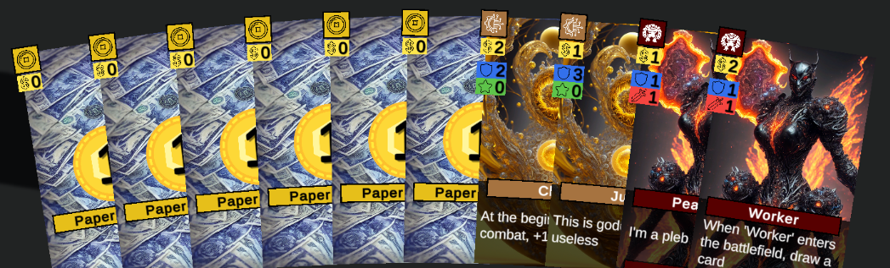

## Sors

>### Setting
>In the cyberpunk dystopia of Nox City you are a prominent mob boss in the constant struggle of underground shenanigans. The fierce competition with corrupt business politicals and rival gang leaders forces you to confront your opponents in 1-on-1 battles. An army of thugs lurks in the streets of Nox city, ready to do your vicious bidding. Loyalty is a fleeting currency, and you know that as long as the payments keep flowing, their allegiance remains. Maybe the market's next-gen technology allows you to gain the edge over your opponents? Your choices echo in the neon-lit streets, where money rules, trust is fragile, and the line between victory and defeat is razor-thin. The city's pulse beats with tension as you contemplate the next moves in this deadly game for control.

### Goal
The first who reduces thier opponent's life total to zero wins the game! You build a deck of cards during playtime to beat your opponent in creature based battle. Both players take actions simultaneously. To improve your deck and the chances to win, get rid of the bad initial cards and spend money to buy stronger ones from the market. Enhance your limited resources with technologies and play your creatures to attack your opponent.

---
### How To
#### Initial deck and resources
Players start with a deck of 10 cards. During gameplay, you improve the deck by buying **Creature** cards and **Technology** cards using **Buys**. You can later play these cards using **Plays**. Buying and playing cards costs money, which you pay with **Cash** earned by playing **Money** cards. _Cash_, _Buys_, _Plays_ and **Prevails** are resources you gain during a turn. _Prevails_ grant you special actions as described in TODO: ADD REF. All resources empty during _Clean Up_ or, in other words, they are set to 0 at the end of the turn. For example, at the beginning of the phase _Invent_ you get _+1 Buy_, which allows you to buy 1 _Technology_ or 1 _Creature_ during this turn.

<figure>
    
    <figcaption>The initial Deck: 6 <i>Money</i> cards: 6 x <i>Paper Money</i>, 2 <i>Technology</i> cards: <i>Junk</i> and <i>Clue</i>, 2 <i>Creature</i> cards: <i>Thug</i> and <i>Worker</i></figcaption>
</figure>

#### The Phases
A turn of *Sors* has 9 phases, 3 of which are mandatory and 6 are optional. At the beginning of the turn, players choose 2 out of the 6 optional phases. Both players play ALL phases that ANY player picked. At the beginning of a phase, each player gets an effect described in the table below. Additionally, everyone who picked an optional phase, also gets the bonus at the beginning of that phase. Most phases are split into distinct steps, more to those detail later (TODO: Add ref). The phases are played in the following order, skipping the optional ones that NEITHER player has picked:

| Phase    | Optional | Effect | Bonus |  Steps
| -------- | ------- | ------- | ------- | -------
| **Phase Selection** | :x: | +2 Cards, choose 2 phases for this turn | - |  2  
| **Card Draw** | :heavy_check_mark: | +2 Cards, discard 1 | Instead: +4 Cards, discard 1 | 2
| **Invent** | :heavy_check_mark: | Buy Technologies from the market | +1 Buy, Technologies cost 1 less | 1+
| **Develop** | :heavy_check_mark: | Play Technologies | +1 Play, +3 Cash | 1+
| **Combat** | :x: | Creatures may deal damgage (Attack step) and block opposing Attackers (Defend step) | - | 4
| **Recruit** | :heavy_check_mark: | Buy Creatures from the market | +1 Buy, Creatures cost 1 less | 1+
| **Deploy** | :heavy_check_mark: | Play Creatures | +1 Play, +3 Cash | 1+
| **Prevail** | :heavy_check_mark: | +1 Prevail | +2 Prevail | 1-4
| **Clean Up** | :x: | The board resets and players get ready for the next turn. | - | 1  

<figure>
    
    <figcaption>At the beginning of the turn, each player picks 2 of the 6 optional phases. The phases <i>Phase Selection</i>, <i>Combat</i> and <i>Clean Up</i> happen every turn.</figcaption>
</figure>

#### Cards and Entities
When you play _Technologies_ and _Creatures_ from your hand, they become **Entities** on the **Battlefield**. A _Card_ and the corresponding _Entity_ are coupled and share the same stats amongst **Cost**, **Health**, **Abilities**, a title and a description. While on the _Battlefield_, _Entities_ may have thier stats changed, for example when taking damage. This does not change the stats of the corresponding _Card_. An _Entity_ **dies** when its _Health_ reaches zero. Then, it leaves the _Battlefield_, the _Entity_ is **destroyed** and the corresponding _Card_ moves to your discard pile. A _Creature's_ **Attack** determines how much damage it deals to other _Entities_ during _Combat_. _Creatures_ may also have **Traits** that influence how that damage is dealt (TODO: ADD REF). Technologies on the other hand have a **Points** value, that doesn't do shit rn.

To buy a card, you spend a _Buy_ and pay an amount of _Cash_ equal to that card's _Cost_. Playing _Technologies_ and _Creatures_ also requires you to pay that _Cost_ and uses a _Play_. On the other hand, playing _Money_ cards is free. _Money_ cards do not have an equivalent _Entity_ but have a **Value**, producing that amount of _Cash_ when you play them. The _Cost_ of a card may vary temporarily due to the a phase bonus or _Abilities_.

<figure>
    
    <figcaption> Cards and Entities </figcaption>
</figure>

#### The Board
You can only play cards from your hand. Playing a _Money_ card is a special action and does not require to spend a _Play_ (you can play unlimited _Money_ cards from your hand). _Money_ cards move to the **Money Zone** and are **discarded** at the end of each phase. If you have unspent _Cash_ and if possible, the corresponding _Money_ cards are returned to your hand. To play a _Technology_ or _Creature_ card you have to spend a _Play_. Doing so, moves the card to the **Play Zone** and creates the corresponding _Entity_ on the _Battlefield_. Cards in the _Play Zone_ can't be interacted with and stay there until the corresponding _Entity_ dies. Once that happens, the _Entity_ leaves the _Battlefield_ and the card moves to your **Discard** pile. You draw cards from your **Deck**, moving them to your **Hand**. Whenever you attempt to draw, but your _Deck_ is empty, you shuffle your _Discard_ pile and move all these cards to your _Deck_. If you still can't draw more cards, you skip that draw instead.

#### The Phases in detail
>**1. Phase Selection**
> Each player draws 2 cards and then chooses 2 phases. Ability trigger: "At the beginning of the turn"

##### Combat

During _Combat_ you can **attack** your opponent and/or their _Technologies_ with your _Creatures_ on the _Battlefield_. In an additional step, you choose how to **block** opposing _Creatures_ with your own _Creatures_.

##### Abilities and Traits
Entities (Creatures and Technologies) on the battlefield
