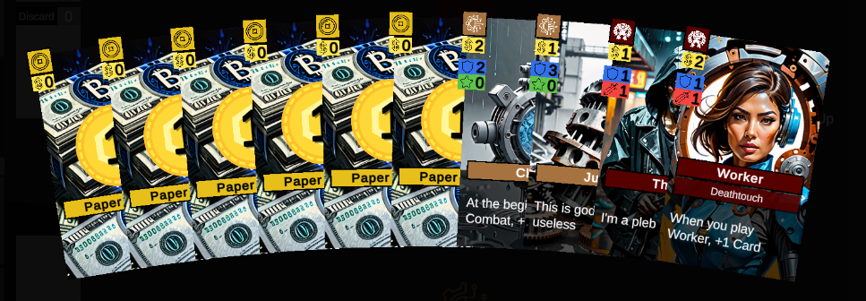

# Sors

>### Setting
>In the cyberpunk dystopia of Nox City you are a prominent mob boss in the constant struggle of underground shenanigans. The fierce competition with corrupt business politicals and rival gang leaders forces you to confront your opponents in 1-on-1 battles. An army of thugs lurks in the streets of Nox city, ready to do your vicious bidding. Loyalty is a fleeting currency, and you know that as long as the payments keep flowing, their allegiance remains. Maybe the market's next-gen technology allows you to gain the edge over your opponents? Your choices echo in the neon-lit streets, where money rules, trust is fragile, and the line between victory and defeat is razor-thin. The city's pulse beats with tension as you contemplate the next moves in this deadly game for control.

### Goal
The first who reduces thier opponent's life total to zero wins the game! You build a deck of cards during playtime to beat your opponent in creature based battle. Both players take actions simultaneously. To improve your deck and the chances to win, get rid of the bad initial cards and spend money to buy stronger ones from the market. Enhance your limited resources with technologies and play your creatures to attack your opponent.

---

### How To

#### Deck building and using resources
Players start with a deck of 10 cards. During gameplay, you improve the deck by buying **Creature** cards and **Technology** cards using **Buys**. You can later play these cards using **Plays**. Buying and playing cards costs money, which you pay with **Cash** earned by playing **Money** cards. Playing _Money_ is a special action and does not require to spend a _Play_ (you can play unlimited _Money_ cards from your hand). _Cash_, _Buys_, _Plays_ and **Prevails** are resources you gain during a turn. _Prevails_ grant you special actions as described in TODO: ADD REF. All resources empty during _Clean Up_ (at the end of the turn, they are set to 0). For example, at the beginning of the phase _Invent_ you get _+1 Buy_, which allows you to buy 1 _Technology_ or 1 _Creature_ during this turn.

<figure>
    
    <figcaption>The initial Deck: 6 <i>Money</i> cards: 6 x <i>Paper Money</i>, 2 <i>Technology</i> cards: <i>Junk</i> and <i>Clue</i>, 2 <i>Creature</i> cards: <i>Peasant</i> and <i>Worker</i></figcaption>
</figure>

#### The Phases
A turn of *Sors* has 9 phases, 3 of which are mandatory and 6 are optional. At the beginning of the turn, players choose 2 out of the 6 optional phases. Both players play ALL phases that ANY player picked, and everyone who picked it, gets a bonus during that phase as described below. Most phases are split into distinct steps, more to those detail later (TODO: Add ref). The phases are played in the following order, skipping the optional ones that NEITHER player has picked:

| Phase    | Optional | Effect | Bonus |  Steps
| -------- | ------- | ------- | ------- | -------
| **Phase Selection** | :x: | +2 Cards, choose 2 phases for this turn | - |  2  
| **Card Draw** | :heavy_check_mark: | +2 Cards, discard 1 | Instead: +4 Cards, discard 1 | 2
| **Invent** | :heavy_check_mark: | Buy Technologies from the market | +1 Buy, Technologies cost 1 less | 2+
| **Develop** | :heavy_check_mark: | Play Technologies | +1 Play, +3 Money | 2+
| **Combat** | :x: | Creatures may deal damgage (Attack step) and block opposing Attackers (Defend step) | - | 4
| **Recruit** | :heavy_check_mark: | Buy Creatures from the market | +1 Buy, Creatures cost 1 less. | 2+
| **Deploy** | :heavy_check_mark: | Play Creatures | +1 Play, +3 Money | 2+
| **Prevail** | :heavy_check_mark: | +1 Prevail | +2 Prevail | 1-4
| **Clean Up** | :x: | The board resets and players get ready for the next turn. | - | 1  

<figure>
    
    <figcaption>At the beginning of the turn, each player picks 2 of the 6 optional phases. The phases <i>Phase Selection</i>, <i>Combat</i> and <i>Clean Up</i> happen every turn.</figcaption>
</figure>

#### Combat

#### Abilities
Cards Entities (Creatures and Technologies) that are on the battlefield

#### The Phases in detail
>**1. Phase Selection**
> Each player draws 2 cards and then chooses 2 phases. Ability trigger: "At the beginning of the turn"

